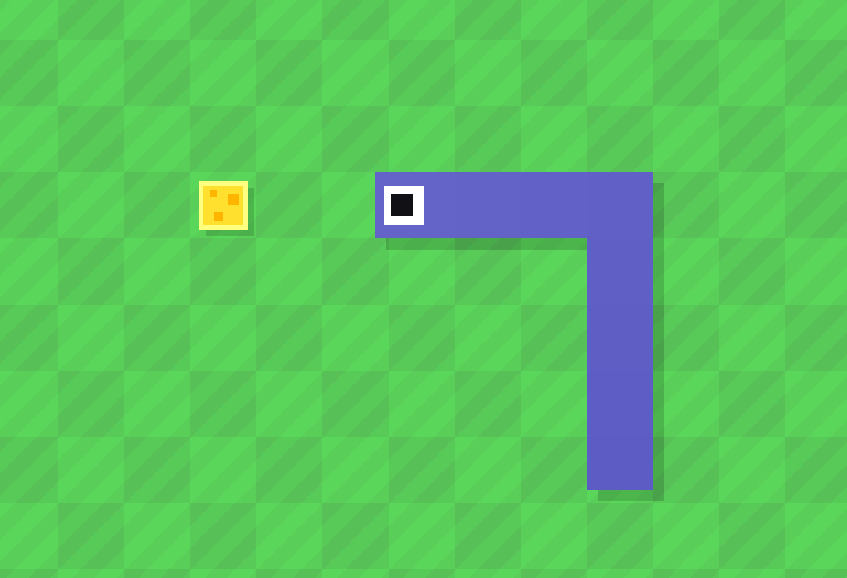

<h1 align="center">cnake</h1>
<p align="center">A snake game in C with SDL2</p>

<p align="center">
	<a href="./LICENSE">
		
	</a>
	<a href="https://github.com/LordOfTrident/cnake/issues">
		
	</a>
	<a href="https://github.com/LordOfTrident/cnake/pulls">
		
	</a>
	<br><br><br>
	
</p>

A "fancy" snake game written in C using [SDL2](https://www.libsdl.org/), where the snake only has
one eye (for some reason) and you eat cheese instead of apples.

## Table of contents
* [Prerequisites](#prerequisites)
* [Quickstart](#quickstart)
* [Bugs](#bugs)
* [Make](#make)

## Prerequisites
Cnake requires the following dependencies to be installed globally:
* [SDL2/SDL_image](https://github.com/libsdl-org/SDL_image)
* [SDL2/SDL_ttf](https://github.com/libsdl-org/SDL_ttf)
* [SDL2/SDL_mixer](https://github.com/libsdl-org/SDL_mixer)

## Quickstart
```sh
$ make
$ make install
$ cnake
```

## Bugs
If you find any bugs, please create an issue and report them.

## Make
Run `make all` to see all the make rules.
